# Keki

# Hosted at https://sleepy-sierra-76511.herokuapp.com/

https://github.com/crushoncode/keki_app

## Table of Contents

[1. About Project](#About-Project)
* [What is 'keki'?](##What-is-keki?)
* [Problem](##The-Problem)
* [Solution](##The-Solution)

[2. Inspiration](#Inspiration)
* [Facebook](##Facebook)
* [Instagram](##Instagram)
* [Pinterest](##Pinterest)

[3. Planning](#Planning)
* [User Stories](##User-Stories)
* [Entity Relationship Diagram](##Entity-Relationship-Diagram)
    - [Version 1](Version-1)
    - [Version 2](Version-2)
    - [Final Version](Final-Version)
* [Trello](##Trello)

[4. Design](#Design)
* [Logo](#Logo)
    - [Version 1](##Version-1)
    - [Version 2](##Version-2)
* [Colour and font](##Colour-and-font)
* [Wireframes](#Wireframes)
    
    [Mobile](Mobile)
    * [Landing Page](Landing-page)
    * [version 1](Version-1)
    * [version 2](Version-2)
    
    [Desktop](Desktop)

[5. Final Product](#Final-Product)

[6. Challenges](#Challenges)

[7. What I've Learned](#What-I've-Learned)

[8. Future Developments](#Future-Developments)

# 1. About Project

## What is ‘*keki*’?

Keki is an online platform where merchants can showcase their cake artistry, promote their baking skills, connect with potential buyers for their cakes, and improve their reputation. Customers can easily find, buy a cake from a seller easily using keki.

## The problem

There are many whom have baking talent and creativity. They enjoy learning new recipes and baking challenges. They want to promote their next best selling confections.

Throughout the year, there are a number of unique days worth celebrating, whether it be a public holiday or a special occasion. These provide opportunities for society to celebrate together, often with food and drinks. However, party planners tend to struggle to find cakes satisfying the below conditions:

- unique and creative design
- customised design
- special requests/dietary restrictions
- the harmony of health and design 
- delivery/pickup options
- active interaction with sellers

## The solution 

Merchants are able to manage their sales through the app. The analytical data provided will help them satisfy the fluctuating demands and trends of customers.

The product can be customisable. They can add/remove ingredients and design as per customer’s preference. With their address information, customers can see the list of cakes made by merchants living close to their location for pickup. Utilising a message system enables customers to chat with a seller to discuss delivery/pickup and the additional price of special request. On top of that, they can leave reviews of a seller. Emails can be frequently sent to members regarding any update of new cakes and best selling cakes. 

# 2. Inspiration

## Facebook
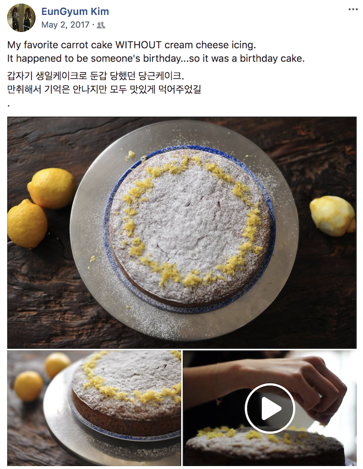

Two of my best friends love baking. Whenever they have free time, they try to make cakes and cookies. Surprisingly, their cakes are well-made and the outcomes are excellent. Their cake artistry would be inspirational in a two sided marketplace. The ability to sell their creations would be icing on the cake. 

## Instagram
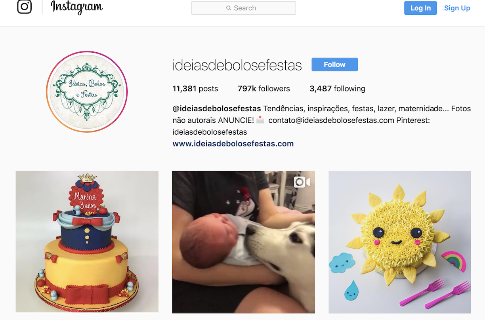

## Pinterest
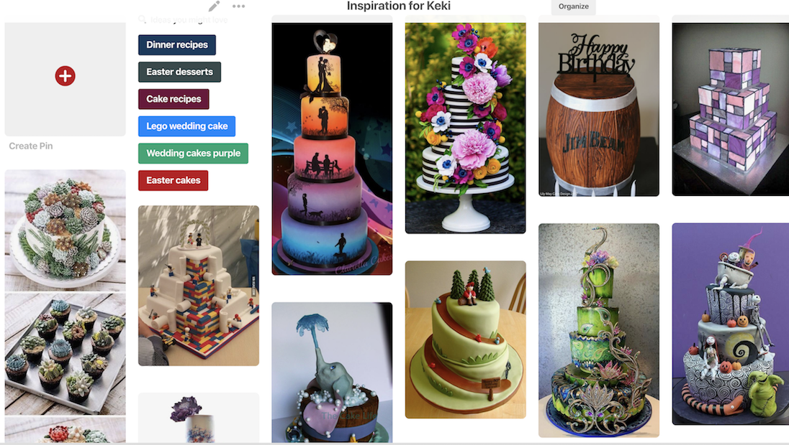

# 3. Planning

## User Stories

https://trello.com/b/iqp75yMC/keki

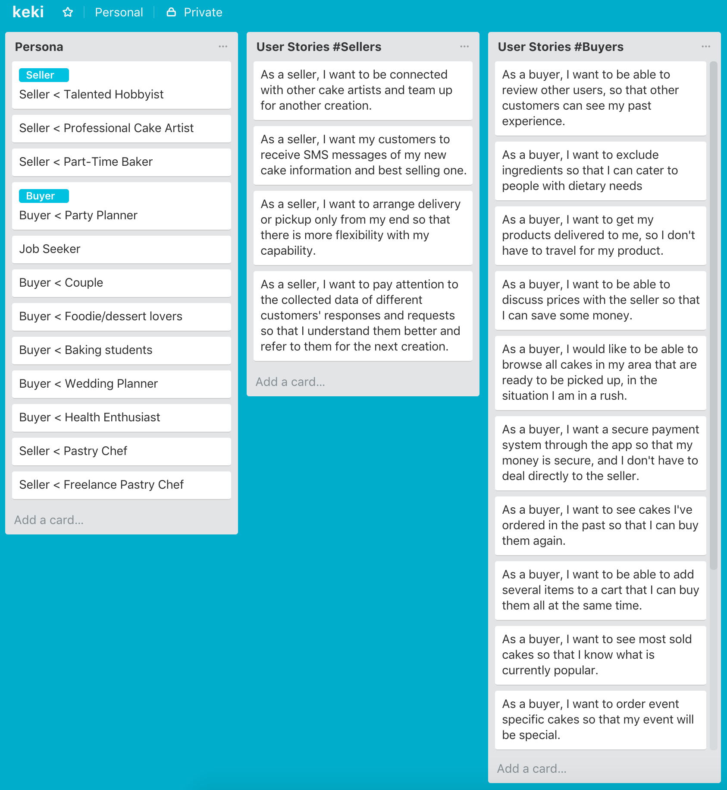

## Entity Relationship Diagram

https://www.dbdesigner.net/designer/schema/168735

- Version 1

- Version 2
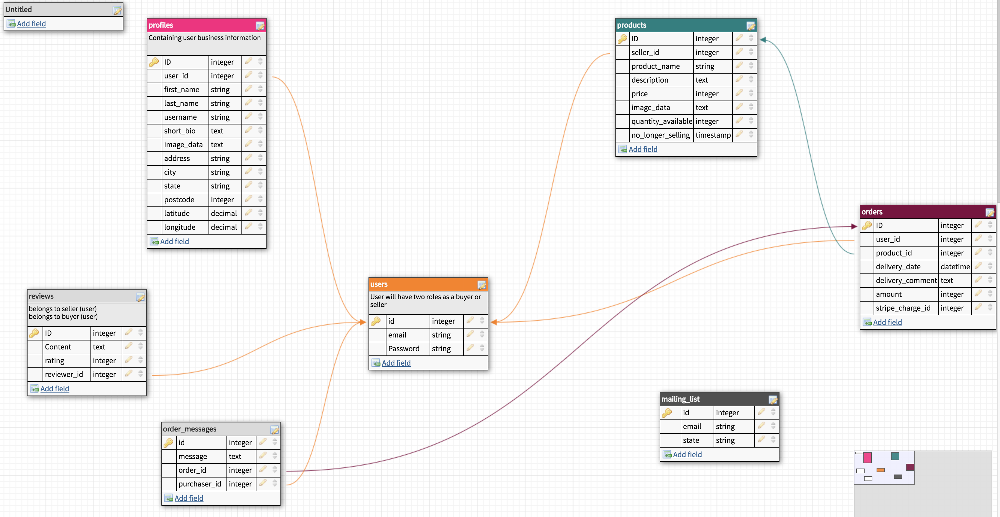

## Trello

https://trello.com/b/HADT0cfM/rails-app-projectserina-ko

I've recorded my progress of the project and managed plans to do next in my trello board. Using Agile in this project helps me organize daily plans and find what challenges and achievement I've had. 

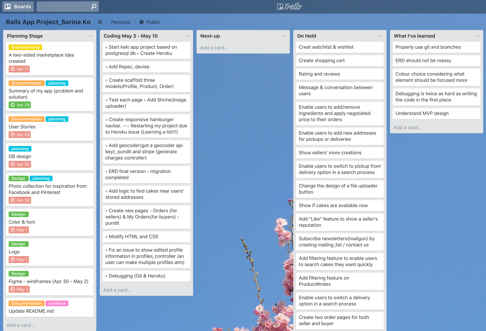

# 4. Design

## Logo
- Version 1
    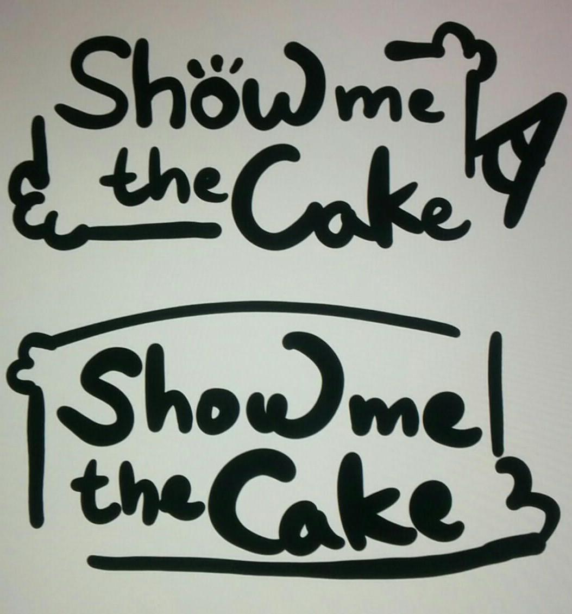

- Version 2
    

Keki means a 'cake' in Japan. This markeplace name is short, easy to pronounce, and easy to remember. Following Ruegen's advice, I've agreed that it’s important to have a balanced combination of simple and quirky.

## Colour and font
- In the beginning, I chose a number of bright and active colours. When I've found colours used in https://panachocolate.com/ through Gretch, it has turned my thought to go for modern background color. It can be distracting to have both strong and bright background color and product photos.
    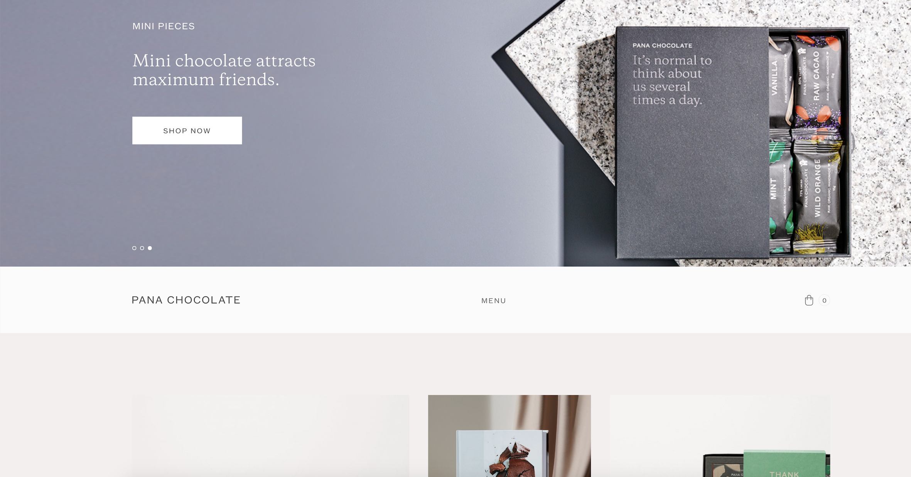
    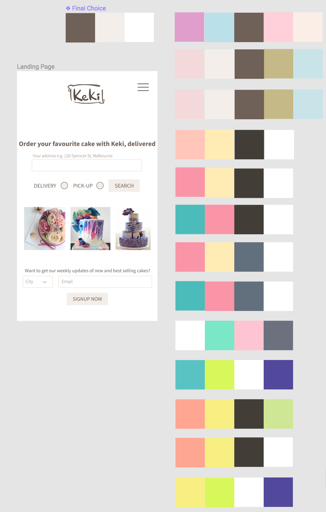

- Source Sans Pro is a sans serif typeface. The font offers a clean and friendly simplicity. 

## Wireframes

https://www.figma.com/file/F8Fojc4yfYSTZ2Lrx7kR0NgT/Keki

* Mobile

  - Landing page
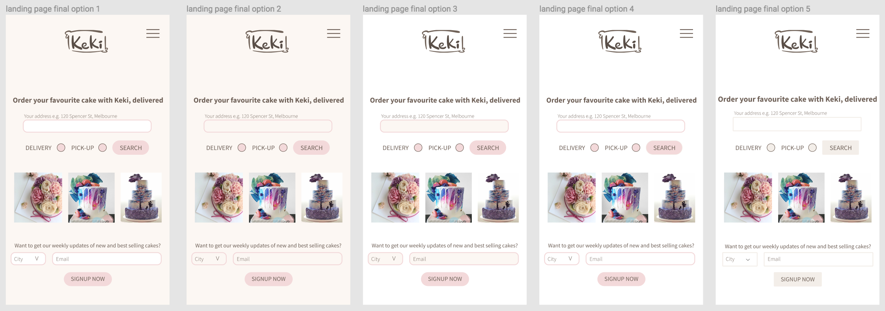
  - Version 1
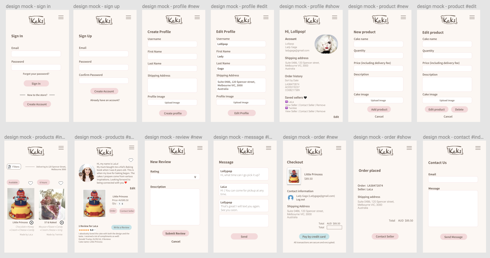
  - Version 2
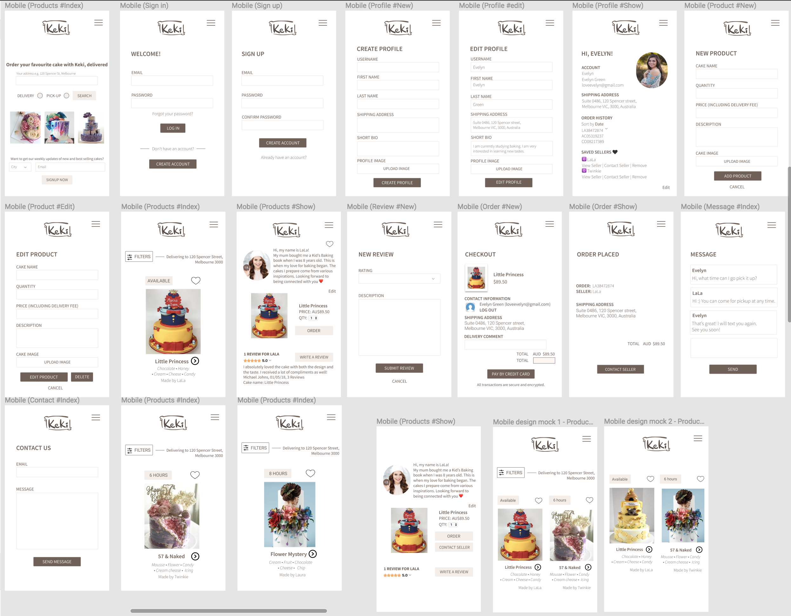

* Desktop

# 5. Final Product

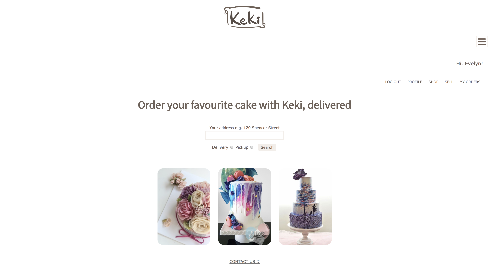
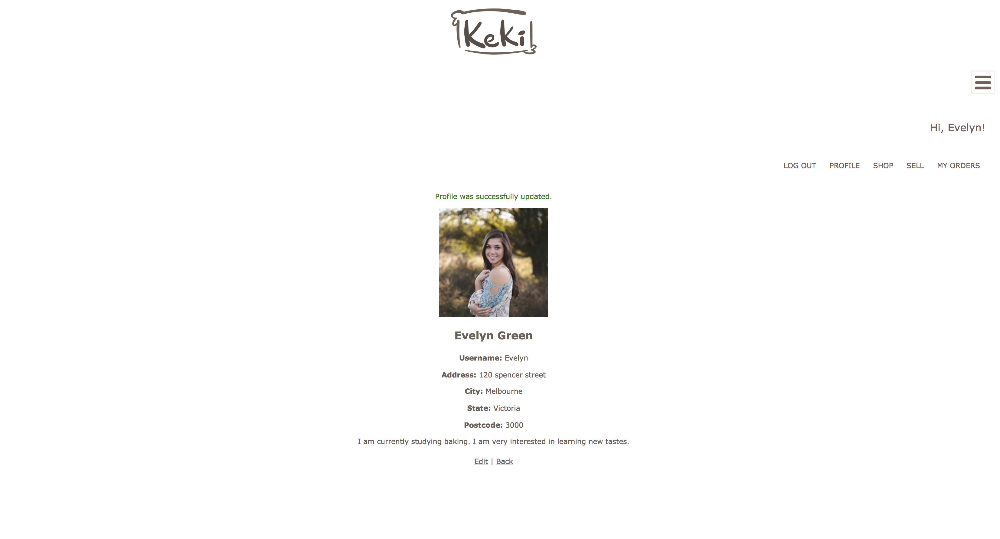
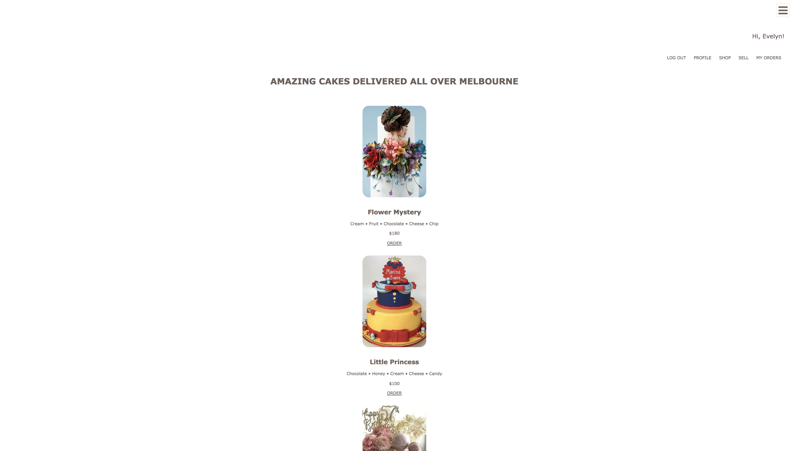
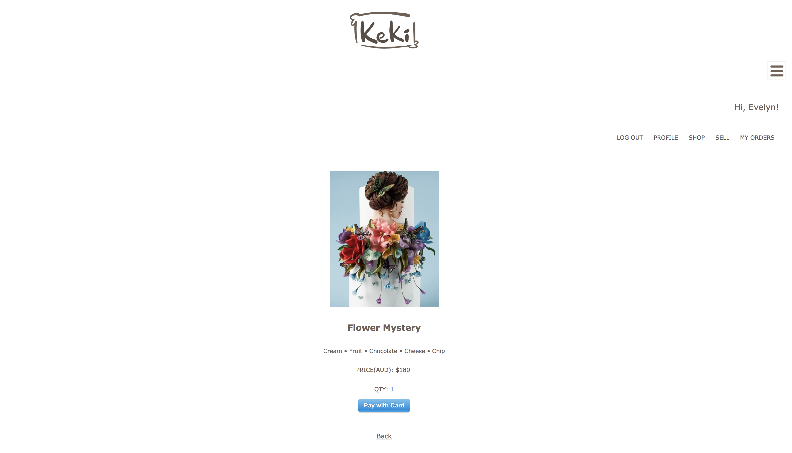

# 6. Challenges
- Debugging 
- The data models and attributes
- Working with an API 

# 7. What I've Learned
- Properly use git and branches
- ERD should not be messy.
- Colour choice considering what element should be focused more
- Debugging is twice as hard as writing the code in the first place.
- Understand MVP design

# 8. Future Developments
- Watchlist
- Wishlist
- Shopping cart
- Rating and reviews
- Message & conversation between users
- Enable users to add/remove ingredients and apply negotiated price to their orders
- Enable users to add new addresses for pickups or deliveries 
- Show sellers' more creations 
- Enable users to switch a delivery option in a search process
- Change the design of a file uploader button
- Add "Like" feature to show a seller's reputation
- Show if cakes are available now
- Subscribe newsletters(mailgun) by creating mailing_list model
- Contact us(mailgun)
- Add filtering feature to enable users to search cakes they want quickly
- Apply "Pundit" to product and order.
- Create two order pages for both seller and buyer
